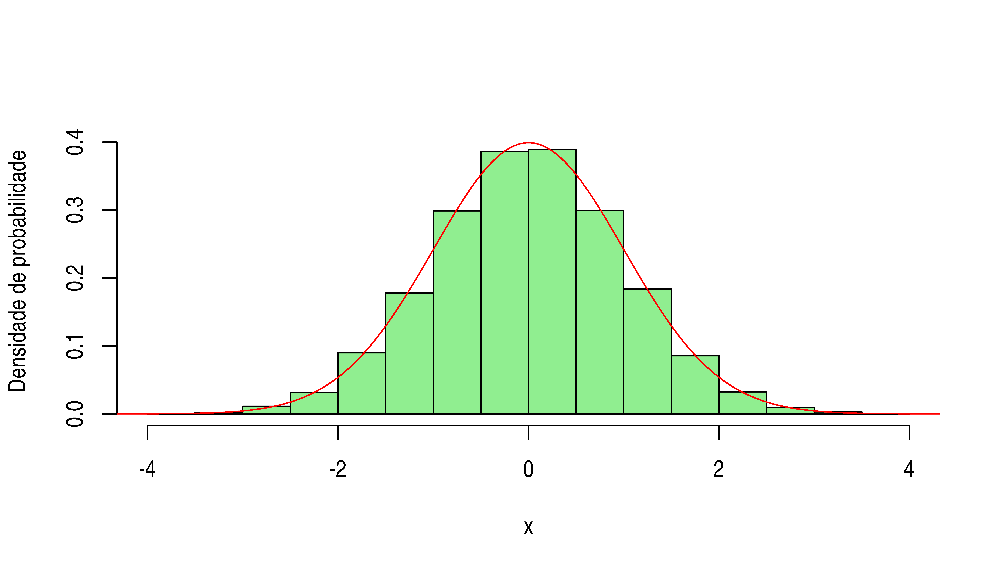

# Distribuições de probabilidade

Na análise de confiabilidade, nosso objeto de estudo (evento de interesse) é o tempo de vida de equipamentos ou sistemas, seus equivalentes e derivados (e.g. tempo médio entre falhas, taxa de falha).

O procedimento adotado para este tipo de análise envolve ajustar a um determinado **modelo probabilistico**, em outras palavras, utiliza-se os dados de falha para estimar os parâmetros de uma **função de densidade de probabilidade**. A vantagem desta abordagem está no significado e aplicabilidade associados ao valor dos parâmetros da distribuição de probabilidade.

**O que é uma função de densidade de probabilidade?**

